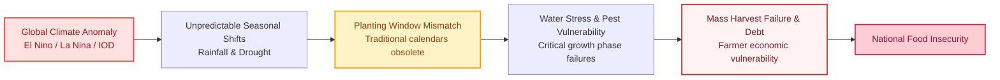
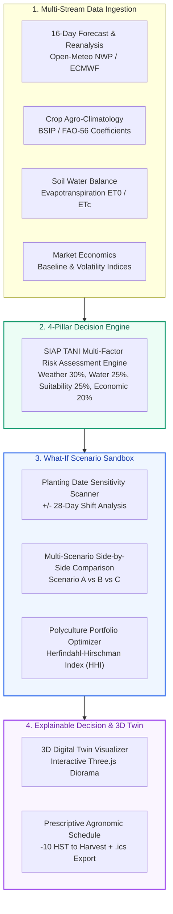

# SIAP TANI — Climate-Agricultural Decision Support System

<div align="center">

[](https://hology.ub.ac.id/)
[-blue?style=for-the-badge)](#)
[](#)
[](#)

### *"Simulasikan Sebelum Menanam — Simulate Before You Plant."*

**A predictive Decision Support System (DSS) empowering farmers and land managers to test, simulate, and compare planting scenarios against climate variability, water availability, and economic risk before committing resources in the field.**

[Try Live Demo](https://ub-holodev.vercel.app/) • [View Methodology](#methodology--scientific-grounding) • [System Architecture](#system-architecture)

</div>

---

```
                                    [ HERO DEMO / PREVIEW ]
   +-----------------------------------------------------------------------------------------+
   |                                                                                         |
   |              [ 3D DIGITAL TWIN FIELD ]             [ LIVE WHAT-IF DSS CONTROLS ]        |
   |                                                                                         |
   |     ┌──────────────────────────────────────┐     ┌────────────────────────────────┐     |
   |     │   Live 3D Crop Growth & Soil State   │     │  Optimal Planting Window:      │     |
   |     │   Dynamic Weather (Sun/Rain/Drought) │     │  Nov 12 - Nov 26 (Score: 88)   │     |
   |     │   Multi-Crop Polyculture Zoning      │     │  Water Stress Index: LOW (12%) │     |
   |     └──────────────────────────────────────┘     └────────────────────────────────┘     |
   |                                                                                         |
   +-----------------------------------------------------------------------------------------+
                    (Insert Primary App Screenshot / Demonstration GIF Here)
```

---

## The Problem

Climate change is actively disrupting agricultural rhythms across Indonesia:



### The Missing Gap in Existing AgriTech
Most agricultural applications today are **reactive and post-planting**—focusing merely on logbook bookkeeping after capital has already been spent, or offering isolated, static weather charts that farmers find difficult to translate into actionable decisions. Farmers lack a risk-free **"What-If Sandbox"** to test decisions *before* seeds and fertilizers are purchased.

---

## Our Solution: SIAP TANI

**SIAP TANI** is a pre-planting **Decision Support System (DSS)** designed to replace guesswork with data-driven simulation. By synthesizing 16-day numerical weather predictions, soil water balance models, commodity agrometeorological thresholds, and market price volatility, SIAP TANI evaluates planting feasibility across spatial and temporal dimensions.

Instead of only telling farmers what the weather is today, SIAP TANI answers critical pre-planting questions:
* *"What if I plant Rice on November 10 versus delaying by 14 days?"*
* *"What if I switch this plot from Corn to Soybean under forecasted dry spells?"*
* *"How should I divide my land across multiple crops to minimize total failure risk?"*

---

## How It Works



---

## Core Features

| Feature | Description | Impact |
|:---|:---|:---|
| **4-Pillar Risk Engine** | Quantifies aggregate planting risk (0–100 score) decomposed into **Weather Risk (30%)**, **Water Risk (25%)**, **Crop Suitability (25%)**, and **Economic Volatility (20%)**. | Replaces intuition with transparent, weighted risk indicators. |
| **What-If Scenario Sandbox** | Live date-shift slider scanning +/- 28 days to reveal optimal planting windows with minimized drought and flood hazards. | Prevents costly timing mismatches before committing capital. |
| **Multi-Scenario Comparison** | Side-by-side comparative matrix evaluating multiple commodities (e.g., Rice vs Corn vs Soybean) with automated *Best Decision Picker*. | Identifies the most resilient crop under dynamic weather projections. |
| **3D Digital Twin Field** | Interactive WebGL diorama (Three.js) displaying procedural crop stages, soil moisture levels, and simulated dynamic weather conditions. | Bridges abstract numerical metrics into an intuitive visual medium. |
| **Polyculture Land Portfolio** | Land-use diversification simulator calculating the **Herfindahl-Hirschman Index (HHI)** to mitigate monoculture pest and price crash risks. | Maximizes farm revenue stability through balanced crop allocation. |

---

## The Core Innovation: Beyond Static Data

Traditional apps stop at data display. SIAP TANI transforms raw data into **prescriptive simulations**:

$$\text{Raw Climate Data} \;\longrightarrow\; \text{Agronomic Simulation} \;\longrightarrow\; \text{Risk Decomposition} \;\longrightarrow\; \mathbf{Actionable\;Decision}$$

```
   TRADITIONAL WEATHER APPS                      SIAP TANI DECISION SUPPORT
   ────────────────────────                      ──────────────────────────
   "Rainfall will be 140 mm."      ───►          "Planting on Nov 15 exposes flowering phase (45 HST)
                                                  to severe water deficit. Delaying to Nov 28 reduces
                                                  water stress by 42% and increases DSS Score to 86/100."
```

---

## What-If Simulation in Action

Consider a land manager in East Java facing uncertain monsoon onset:

| Evaluation Dimension | **Scenario A** (Plant Now - Nov 10) | **Scenario B** (Delay +14 Days - Nov 24) | **Scenario C** (Switch to Soybean) |
|:---|:---:|:---:|:---:|
| **Target Crop** | Wetland Rice (*Oryza sativa*) | Wetland Rice (*Oryza sativa*) | Soybean (*Glycine max*) |
| **Weather Risk** | High (Early dry spell) | Low (Steady precipitation) | Low (Tolerant to moderate rain) |
| **Water Balance (FAO-56)** | 38% Deficit during Tillering | Optimal Soil Moisture | 100% Water Demand Satisfied |
| **Agro-Climate Suitability** | 64 / 100 | 88 / 100 | 84 / 100 |
| **Overall DSS Score** | **52 / 100 (High Risk)** | **88 / 100 (Recommended Winner)** | **82 / 100 (Viable Alternative)** |
| **System Recommendation** | *Avoid planting. High drought risk.* | *Optimal planting window.* | *Strong alternative for low water.* |

---

## 3D Digital Twin: Purposeful Visualization

The **Three.js WebGL 3D Digital Twin** is not decorative—it is an **interpretability bridge** designed for rapid decision-making:

$$\text{Complex Hydro-Meteorological Tables} \;\xrightarrow{\quad\text{Three.js 3D Twin}\quad}\; \text{Intuitive Visual Diorama}$$

* **Visual Soil Health:** Soil textures dynamically shift hue to indicate moisture saturation, optimal balance, or severe drought parching.
* **Procedural Growth Stages:** Visualizes vegetative, flowering, and ripening morphology according to Days After Planting (HST).
* **Dynamic Weather Particles:** Real-time sun azimuth, cloud density, and rain particle systems reflect forecasted localized conditions.
* **Polyculture Land Partitions:** Multi-zone bounding stakes illustrate spatial crop allocation and land-share percentages in real-time.

---

## Competition Alignment & Impact: Bloom Beyond

SIAP TANI directly embodies the HOLOGY 9.0 theme: **"Bloom Beyond: Where Ideas Take Root and Reach Further"**:

```
  [1] ROOT (Real-World Problem)
  Rooted in the existential crisis of Indonesian smallholders facing climate volatility and seasonal unpredictability.
                           │
                           ▼
  [2] GROW (Validated Science & Engineering)
  Grows by translating FAO-56 evapotranspiration models, BSIP crop norms, and NWP forecasts into a responsive DSS engine.
                           │
                           ▼
  [3] BLOOM (Empowering Simulation)
  Blooms by giving farmers a risk-free What-If sandbox to test scenarios virtually before risking real capital.
                           │
                           ▼
  [4] REACH BEYOND (Sustainable Food Security)
  Reaches beyond the individual farm to bolster regional food supply stability, minimize crop failure rates, and optimize water stewardship.
```

### Problem-Response Matrix

| Challenge in Indonesian Agriculture | SIAP TANI Response | Subtheme Relevance |
|:---|:---|:---|
| **Seasonal shift & unpredictable rains** | +/- 28-Day Planting Window Scanner & Sensitivity Engine | Smart Agriculture (Precision Timing) |
| **Water scarcity & over-irrigation** | Daily FAO-56 Crop Water Balance ($ET_c = K_c \times ET_0$) | Resource Efficiency & Water Conservation |
| **Monoculture price crashes & pest blooms** | Polyculture Portfolio Optimizer with HHI Diversification | Economic Resilience & Food Security |
| **Complex meteorological charts** | Interactive 3D Digital Twin & Explainable Decision Breakdown | Inclusive Technology & Usability |
| **Guesswork-based planting habits** | Pre-Planting Simulation & Comparative Matrix | Data-Driven Agricultural Transformation |

---

## Technology Stack

SIAP TANI is engineered for high computational accuracy, low-latency client rendering, and seamless cross-device accessibility:

```
+─────────────────────────────────────────────────────────────────────────────────────────+
|                                    APPLICATION STACK                                    |
+─────────────────────────────────────────────────────────────────────────────────────────+
  [ FRONTEND & UI ]         Nuxt 4 • Vue 3 (Composition API) • Tailwind CSS • Lucide Icons
  [ 3D DIGITAL TWIN ]       Three.js (WebGL Procedural Plants, Dynamic Shaders, OrbitControls)
  [ GIS & MAPPING ]         Leaflet.js • OpenStreetMap Tiles • BigDataCloud Reverse Geocoding
  [ BACKEND & SERVICES ]    Nuxt Nitro Server Engine • REST Handlers • Service Architecture
  [ CLIMATE & AGRO DATA ]   Open-Meteo 16-Day NWP (ECMWF/GFS) • FAO-56 Hydrology Engine
  [ PERSISTENCE & AUTH ]    Supabase PostgreSQL • Supabase Auth • Browser LocalStorage Cache
+─────────────────────────────────────────────────────────────────────────────────────────+
```

---

## System Architecture

```
                                  [ CLIENT LAYER ]
               Nuxt 4 / Vue 3 SPA + Three.js 3D Canvas + Leaflet GIS Picker
                                         │
                                         ▼ (Reactive State & Composables)
                        useSimulation.ts  •  useAuth.ts
                                         │
                                         ▼ ($fetch / Nitro Server Endpoints)
+─────────────────────────────────────────────────────────────────────────────────────────+
|                                  NITRO SERVER LAYER                                     |
|     /api/simulate         /api/portfolio         /api/weather         /api/crops        |
+─────────────────────────────────────────────────────────────────────────────────────────+
                                         │
                 ┌───────────────────────┼───────────────────────┐
                 ▼                       ▼                       ▼
    [ RISK ENGINE SERVICE ]     [ AGRONOMY SERVICE ]    [ WEATHER AGGREGATOR ]
    • Weather Risk (30%)        • FAO-56 Water Balance  • 16-Day Forecast NWP
    • Water Risk (25%)          • Growth Phases (HST)   • Temperature Extremes
    • Suitability (25%)         • Financial & ROI Model • Historical ZOM Normals
    • Economic Risk (20%)       • Fertilizer Schedules  • Precipitation Trend
                 │                       │                       │
                 └───────────────────────┼───────────────────────┘
                                         ▼
+─────────────────────────────────────────────────────────────────────────────────────────+
|                               PERSISTENCE & STORAGE                                     |
|            Supabase PostgreSQL (`profiles`, `simulations`, `scenarios`)                |
+─────────────────────────────────────────────────────────────────────────────────────────+
```

---

## Methodology & Scientific Grounding

Recommendations in SIAP TANI are derived from established agricultural standards:

1. **Crop Evapotranspiration & Water Balance ($ET_c$):** Calculated following **FAO Irrigation and Drainage Paper No. 56**, estimating crop water requirements per phenological growth stage ($ET_c = K_c \times ET_0$).
2. **Crop Agro-Climatology Norms:** Built upon data from the **Indonesian Agency for Agricultural Standard Instruments (BSIP Agroklimat)** and **Balitbangtan Kementan RI**, cross-referencing cardinal temperature, humidity, and rainfall tolerances.
3. **Four-Pillar Risk Engine:**
   $$\text{Composite Risk} = 0.30(R_{\text{weather}}) + 0.25(R_{\text{water}}) + 0.25(R_{\text{suitability}}) + 0.20(R_{\text{economic}})$$
4. **Diversification Index:** Utilizes the **Herfindahl-Hirschman Index (HHI)**:
   $$HHI = \sum_{i=1}^{N} s_i^2 \quad (\text{where } s_i \text{ is the percentage share of crop } i)$$
   Lower HHI values indicate higher diversification and superior ecological/financial resilience.

---

## Live Demo & Getting Started

### Live Access
* **Production Deployment:** [https://ub-holodev.vercel.app/](https://ub-holodev.vercel.app/)
* **Demo Evaluation Mode:** Instant 1-click demo access is available on the Login/Register modal for immediate judging without requiring email confirmation.

### Running Locally

```bash
# 1. Clone the repository
git clone https://github.com/JoshNells13/UB-Holodev.git
cd UB-Holodev

# 2. Install dependencies
npm install

# 3. Configure environment variables (.env)
SUPABASE_URL=https://your-project.supabase.co
SUPABASE_KEY=your-anon-or-service-role-key

# 4. Start local development server
npm run dev
```

Application will be accessible at `http://localhost:3000`.

---

## Project Status & Roadmap

- [x] **Core DSS Risk Assessment Engine (4 Pillars)** — *Completed*
- [x] **Interactive 3D Digital Twin (Procedural Crops & Dynamic Weather)** — *Completed*
- [x] **What-If Date-Shift Sensitivity Sandbox** — *Completed*
- [x] **Multi-Scenario Side-by-Side Comparison Matrix** — *Completed*
- [x] **Polyculture Land Portfolio Simulator (HHI Index)** — *Completed*
- [x] **Automated Agronomic Calendar with .ics Calendar Export** — *Completed*
- [x] **User Authentication & Cloud Persistence (Supabase)** — *Completed*
- [ ] *IoT Soil Moisture Sensor Integration via MQTT* — *Roadmap*
- [ ] *Hyperlocal Satellite Soil Moisture (Sentinel-2)* — *Roadmap*

---

## Development Team

Developed for **HOLOGY 9.0 Fakultas Ilmu Komputer Universitas Brawijaya** (Cabang Lomba **HoloDev - Software Development**):

* **Team Name:** [UB-Holodev Team]
* **Institution:** Universitas Brawijaya
* **Repository:** [https://github.com/JoshNells13/UB-Holodev](https://github.com/JoshNells13/UB-Holodev)

---

## License

This project is licensed under the [MIT License](LICENSE).

<div align="center">

**SIAP TANI — Simulasikan Sebelum Menanam.**  
*Supporting Climate-Resilient Agriculture & National Food Security.*

</div>
