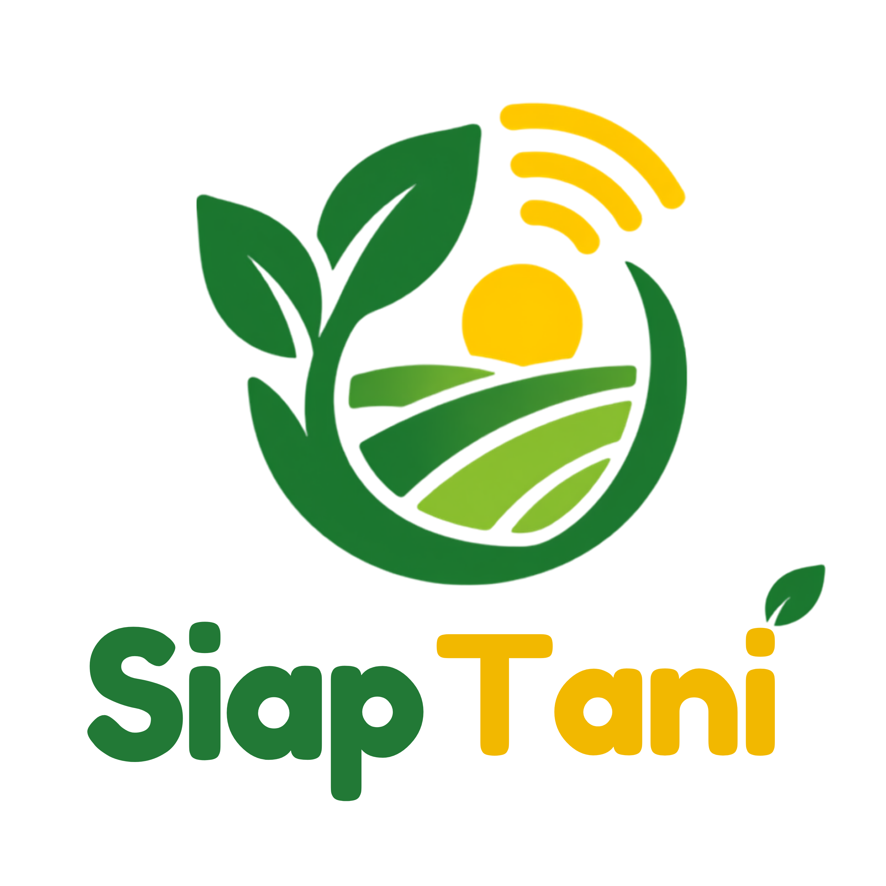
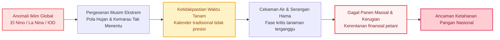
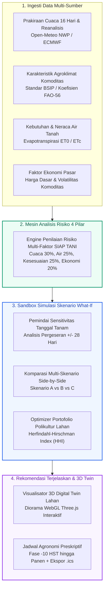
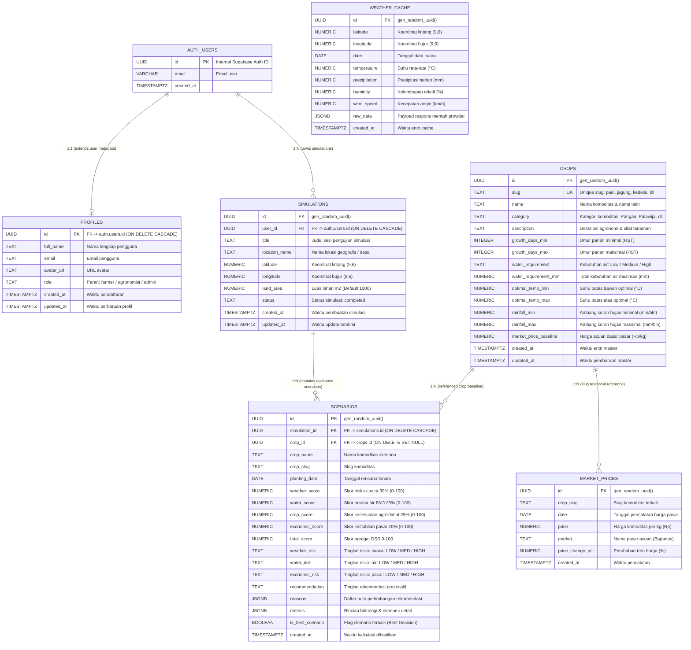

<div align="center">



# SIAP TANI — Climate-Agricultural Decision Support System

[](https://hology.ub.ac.id/)
[-blue?style=for-the-badge)](#)
[](#)
[](#)

### *"Simulasikan Sebelum Menanam — Keputusan Presisi untuk Ketahanan Pangan"*

**Platform Decision Support System (DSS) prediktif yang memberdayakan petani dan pengelola lahan untuk menguji, mensimulasikan, dan membandingkan skenario tanam terhadap risiko iklim, ketersediaan air, dan volatilitas ekonomi sebelum modal dialokasikan di lahan nyata.**

[Coba Demo Langsung](https://siaptani.vercel.app/) • [Fitur Utama](#4-fitur-utama) • [Arsitektur Sistem](#10-arsitektur-sistem) • [Skema Basis Data & ERD](#11-skema-basis-data--entity-relationship-diagram-erd) • [Metodologi](#12-metodologi--landasan-ilmiah)

</div>

---

```
                                    [ DEMO / PRATINJAU UTAMA ]
   +-----------------------------------------------------------------------------------------+
   |                                                                                         |
   |              [ 3D DIGITAL TWIN LAHAN ]             [ KONTROL DSS WHAT-IF REAL-TIME ]    |
   |                                                                                         |
   |     ┌──────────────────────────────────────┐     ┌────────────────────────────────┐     |
   |     │   Pertumbuhan Tanaman & Tanah 3D     │     │  Jendela Tanam Optimal:        │     |
   |     │   Cuaca Dinamis (Cerah/Hujan/Kering) │     │  12 Nov - 26 Nov (Skor: 88)    │     |
   |     │   Zonasi Polikultur Multi-Komoditas  │     │  Indeks Cekaman Air: RENDAH    │     |
   |     └──────────────────────────────────────┘     └────────────────────────────────┘     |
   |                                                                                         |
   +-----------------------------------------------------------------------------------------+
                    (Tempatkan Tangkapan Layar / GIF Demonstrasi Aplikasi di Sini)
```

---

## 1. Latar Belakang dan Urgensi Masalah

Krisis iklim global bukan lagi sekadar prediksi masa depan, melainkan ancaman nyata yang secara aktif mengacaukan pola musiman pertanian di Indonesia:



### Kesenjangan pada Solusi Pertanian Eksisting
Mayoritas aplikasi pertanian saat ini bersifat **reaktif dan pasca-tanam**—hanya berfokus pada pencatatan buku kas pengeluaran setelah modal dibelanjakan, atau menyajikan grafik prakiraan cuaca mentah yang abstrak dan sulit diterjemahkan petani menjadi aksi konkret. Petani tidak memiliki sarana **"What-If Sandbox"** untuk menguji skenario risiko *sebelum* bibit dan pupuk dibeli.

---

## 2. Solusi Kami: SIAP TANI

**SIAP TANI** hadir sebagai **Climate-Agricultural Decision Support System (DSS)** yang dirancang untuk menggantikan spekulasi dengan simulasi berbasis data terpadu. Melalui integrasi prakiraan numerik cuaca 16 hari, kalkulasi neraca air tanah harian, ambang batas agroklimat komoditas, dan analisis fluktuasi ekonomi pasar, SIAP TANI mengevaluasi kelayakan tanam secara spasial dan temporal.

Alih-alih sekadar menampilkan data cuaca hari ini, SIAP TANI menjawab pertanyaan paling krusial sebelum menanam:
* *"Bagaimana jika saya menanam Padi pada 10 November dibandingkan menundanya 14 hari?"*
* *"Bagaimana jika saya mengganti lahan ini dari Jagung ke Kedelai saat diproyeksikan musim kering?"*
* *"Bagaimana cara membagi lahan ke dalam beberapa komoditas untuk meminimalkan risiko gagal panen total?"*

---

## 3. Cara Kerja Sistem



---

## 4. Fitur Utama

| Fitur Utama | Deskripsi Kapabilitas | Nilai Manfaat |
|:---|:---|:---|
| **Engine Risiko 4 Pilar** | Menguantifikasi risiko tanam agregat (skor 0–100) yang didekomposisi menjadi **Risiko Cuaca (30%)**, **Risiko Kebutuhan Air (25%)**, **Kesesuaian Agroklimat (25%)**, dan **Volatilitas Ekonomi (20%)**. | Menggantikan asumsi subjektif dengan indikator risiko terbobot yang transparan. |
| **Sandbox Simulasi What-If** | Slider interaktif pemindai sensitivitas tanggal tanam (+/- 28 hari) untuk mendeteksi jendela tanam dengan risiko kekeringan atau banjir terendah. | Mencegah kerugian salah waktu tanam sebelum modal dikeluarkan. |
| **Komparasi Multi-Skenario** | Matriks evaluasi berdampingan (*side-by-side*) antar berbagai pilihan tanaman (misal: Padi vs Jagung vs Kedelai) dilengkapi penentu skenario terbaik otomatis (*Best Decision Picker*). | Memberikan kejelasan komparatif komoditas yang paling tahan risiko iklim. |
| **3D Digital Twin Lahan** | Diorama visual WebGL interaktif (Three.js) yang merefleksikan fase morfologi tanaman, kondisi kelembapan tanah, dan simulasi cuaca dinamis secara real-time. | Menjembatani data numerik yang rumit menjadi visualisasi yang mudah dipahami. |
| **Portofolio Lahan Polikultur** | Simulator diversifikasi lahan berbasis **Herfindahl-Hirschman Index (HHI)** untuk memitigasi bahaya serangan hama massal dan anjloknya harga monokultur. | Menjaga stabilitas pendapatan petani melalui pembagian zonasi lahan yang seimbang. |

---

## 5. Inovasi Utama: Melampaui Data Statis

Aplikasi konvensional berhenti pada penyajian data. SIAP TANI mentransformasikan data mentah menjadi **simulasi preskriptif**:

$$\text{Data Mentah Iklim} \;\longrightarrow\; \text{Simulasi Agronomi} \;\longrightarrow\; \text{Dekomposisi Risiko} \;\longrightarrow\; \mathbf{Keputusan\;Terukur}$$

```
   APLIKASI CUACA KONVENSIONAL                   SISTEM PENDUKUNG KEPUTUSAN SIAP TANI
   ───────────────────────────                   ────────────────────────────────────
   "Curah hujan diprediksi 140 mm." ───►        "Menanam pada 15 Nov mengekspos fase berbunga (45 HST)
                                                 pada defisit air kritis. Menggeser ke 28 Nov menurunkan
                                                 cekaman air sebesar 42% dan menaikkan skor DSS ke 86/100."
```

Sistem tidak hanya menjawab *"Bagaimana kondisi cuaca saat ini?"*, melainkan *"Apa dampak yang akan terjadi jika saya mengambil keputusan tanam yang berbeda?"*

---

## 6. Simulasi What-If dalam Praktik

Contoh simulasi pengambilan keputusan pada lahan di Jawa Timur menghadapi ketidakpastian awal musim hujan:

| Dimensi Evaluasi | **Skenario A** (Tanam Sekarang - 10 Nov) | **Skenario B** (Tunda +14 Hari - 24 Nov) | **Skenario C** (Ganti ke Kedelai) |
|:---|:---:|:---:|:---:|
| **Komoditas Pilihan** | Padi Sawah (*Oryza sativa*) | Padi Sawah (*Oryza sativa*) | Kedelai (*Glycine max*) |
| **Risiko Cuaca** | Tinggi (Ancaman kekeringan awal) | Rendah (Curah hujan stabil) | Rendah (Toleran cuaca moderat) |
| **Neraca Air (FAO-56)** | Defisit 38% pada fase anakan | Ketersediaan air optimal | 100% Kebutuhan air tercukupi |
| **Kesesuaian Agroklimat** | 64 / 100 (Kurang Sesuai) | 88 / 100 (Sangat Sesuai) | 84 / 100 (Sesuai) |
| **Skor Total DSS** | **52 / 100 (Risiko Tinggi)** | **88 / 100 (Direkomendasikan - Pemenang)** | **82 / 100 (Alternatif Layak)** |
| **Rekomendasi Sistem** | *Hindari tanam. Risiko defisit air tinggi.* | *Jendela tanam terbaik teridentifikasi.* | *Pilihan aman untuk efisiensi air.* |

---

## 7. 3D Digital Twin: Visualisasi Berbasis Fungsi

Penggunaan **Three.js WebGL 3D Digital Twin** bukan sekadar elemen estetika, melainkan **jembatan interpretabilitas data** untuk mempermudah pengambilan keputusan:

$$\text{Tabel Hidrometeorologi Kompleks} \;\xrightarrow{\quad\text{3D Digital Twin}\quad}\; \text{Diorama Visual Intuitif}$$

* **Indikator Visual Tanah:** Tekstur dan saturasi warna tanah berubah dinamis memperlihatkan kondisi tergenang, optimal, atau retak kekeringan.
* **Morfologi Pertumbuhan Prosedural:** Menampilkan bentuk fase vegetatif, pembungaan, hingga pematangan bulir sesuai Hari Setelah Tanam (HST).
* **Partikel Cuaca Dinamis:** Arah pencahayaan matahari, ketebalan awan, dan partikel rintik hujan merefleksikan prakiraan cuaca di lokasi GPS lahan.
* **Partisi Zonasi Polikultur:** Patok batas zonasi lahan 3D beradaptasi secara real-time mengikuti proporsi persentase pembagian komoditas.

---

## 8. Keselarasan Tema & Dampak: Bloom Beyond

SIAP TANI mengakar dan berkembang selaras dengan tema HOLOGY 9.0: **"Bloom Beyond: Where Ideas Take Root and Reach Further"**:

```
  [1] ROOT (Berakar pada Masalah Nyata)
  Berakar dari krisis kerentanan petani kecil Indonesia menghadapi anomali dinamika iklim dan ketidakpastian awal musim tanam.
                           │
                           ▼
  [2] GROW (Berkembang Menjadi Solusi Ilmiah Tervalidasi)
  Berkembang dengan mengintegrasikan standar neraca air FAO-56, karakteristik agroklimat BSIP Kementan, dan prakiraan numerik cuaca.
                           │
                           ▼
  [3] BLOOM (Mekar Memberikan Nilai Guna Nyata)
  Mekar melalui sarana simulasi What-If interaktif yang memungkinkan petani menguji skenario tanam secara virtual sebelum mempertaruhkan modal.
                           │
                           ▼
  [4] REACH BEYOND (Dampak Berkelanjutan bagi Ketahanan Pangan)
  Menjangkau lebih jauh untuk menekan angka gagal panen nasional, mengoptimalkan tata kelola air irigasi, dan memperkuat ketahanan pangan berkelanjutan.
```

### Matriks Masalah & Respons Solusi

| Tantangan Pertanian Indonesia | Respons Solusi SIAP TANI | Relevansi Subtema |
|:---|:---|:---|
| **Pergeseran musim tanam ekstrem** | Pemindai jendela tanam optimal (+/- 28 hari) | Pertanian Cerdas (Presisi Waktu) |
| **Kekurangan atau kelebihan air irigasi** | Kalkulasi neraca air harian FAO-56 ($ET_c = K_c \times ET_0$) | Efisiensi Sumber Daya Air |
| **Anjloknya harga monokultur & hama massal** | Simulator diversifikasi lahan dengan Indeks HHI | Ketahanan Ekonomi & Pangan |
| **Data cuaca teknis yang sulit dipahami** | 3D Digital Twin interaktif & ringkasan keputusan terjelaskan | Inklusivitas Teknologi Petani |
| **Keputusan tanam berbasis tebakan** | Simulasi What-If non-destruktif sebelum komitmen modal | Transformasi Pertanian Berbasis Data |

---

## 9. Teknologi Pendukung (Tech Stack)

SIAP TANI dibangun dengan arsitektur modern berkinerja tinggi:

```
+─────────────────────────────────────────────────────────────────────────────────────────+
|                                    STACK APLIKASI                                       |
+─────────────────────────────────────────────────────────────────────────────────────────+
  [ FRONTEND & UI ]         Nuxt 4 • Vue 3 (Composition API) • Tailwind CSS • Lucide Icons
  [ 3D DIGITAL TWIN ]       Three.js (WebGL Procedural Plants, Dynamic Shaders, OrbitControls)
  [ GIS & PEMETAAN ]        Leaflet.js • OpenStreetMap Tiles • BigDataCloud Reverse Geocoding
  [ BACKEND ENGINE ]        Nuxt Nitro Server Engine • REST Handlers • Service Architecture
  [ DATA AGROKLIMAT ]       Open-Meteo 16-Day NWP (ECMWF/GFS) • FAO-56 Hydrology Engine
  [ BASIS DATA & SESI ]     Supabase PostgreSQL • Supabase Auth • Browser LocalStorage Cache
+─────────────────────────────────────────────────────────────────────────────────────────+
```

---

## 10. Arsitektur Sistem

```
                                  [ LAPISAN KLIEN / UI ]
               Nuxt 4 / Vue 3 SPA + Canvas 3D Three.js + Peta GIS Leaflet
                                         │
                                         ▼ (Composables & State Reaktif)
                        useSimulation.ts  •  useAuth.ts
                                         │
                                         ▼ ($fetch / Nitro Endpoint API)
+─────────────────────────────────────────────────────────────────────────────────────────+
|                                  LAPISAN SERVER NITRO                                   |
|     /api/simulate         /api/portfolio         /api/weather         /api/crops        |
+─────────────────────────────────────────────────────────────────────────────────────────+
                                         │
                 ┌───────────────────────┼───────────────────────┐
                 ▼                       ▼                       ▼
    [ SERVICE ENGINE RISIKO ]   [ SERVICE AGRONOMI ]    [ AGREGATOR CUACA ]
    • Risiko Cuaca (30%)        • Neraca Air FAO-56     • Prakiraan 16 Hari NWP
    • Risiko Air (25%)          • Fase Tumbuh (HST)     • Ambang Suhu Ekstrem
    • Kesesuaian Lahan (25%)    • Proyeksi Finansial    • Normalitas Iklim ZOM
    • Risiko Ekonomi (20%)      • Dosis Rekomendasi     • Tren Curah Hujan
                 │                       │                       │
                 └───────────────────────┼───────────────────────┘
                                         ▼
+─────────────────────────────────────────────────────────────────────────────────────────+
|                               PERSISTENSI & PENYIMPANAN                                 |
|            Supabase PostgreSQL (`profiles`, `simulations`, `scenarios`)                |
+─────────────────────────────────────────────────────────────────────────────────────────+
```

---

## 11. Skema Basis Data & Entity Relationship Diagram (ERD)

Sistem **SIAP TANI** menggunakan arsitektur relasional pada **Supabase PostgreSQL** yang terintegrasi dengan Supabase Authentication, Row Level Security (RLS) terisolasi, dan pemicu otomatis (*database trigger*).

### Entity Relationship Diagram (ERD)



### Kamus Data Seluruh Tabel (Data Dictionary)

#### 1. Tabel `profiles`
Menyimpan profil pengguna yang tersinkronisasi langsung dengan `auth.users` Supabase melalui trigger otomatis `handle_new_user()`.
| Kolom | Tipe Data | Constraint | Deskripsi |
|:---|:---|:---|:---|
| `id` | UUID | PRIMARY KEY, REFERENCES `auth.users(id)` ON DELETE CASCADE | ID unik pengguna terikat dengan Supabase Auth |
| `full_name` | TEXT | Nullable | Nama lengkap pengguna / petani |
| `email` | TEXT | Nullable | Alamat surel aktif |
| `avatar_url` | TEXT | Nullable | URL foto profil pengguna |
| `role` | TEXT | DEFAULT `'farmer'` | Peran pengguna (`farmer`, `agronomist`, `admin`) |
| `created_at` | TIMESTAMPTZ | NOT NULL, DEFAULT `NOW()` | Waktu pendaftaran akun |
| `updated_at` | TIMESTAMPTZ | NOT NULL, DEFAULT `NOW()` | Waktu pembaruan profil pengguna |

#### 2. Tabel `crops`
Master data acuan karakteristik agroklimat dan fisiologis tanaman mengacu standar BSIP Kementan dan FAO-56.
| Kolom | Tipe Data | Constraint | Deskripsi |
|:---|:---|:---|:---|
| `id` | UUID | PRIMARY KEY, DEFAULT `gen_random_uuid()` | ID unik master komoditas |
| `slug` | TEXT | UNIQUE, NOT NULL | Pengidentifikasi unik tanaman (misal: `padi`, `jagung`, `kedelai`) |
| `name` | TEXT | NOT NULL | Nama komoditas lengkap beserta nama latin |
| `category` | TEXT | DEFAULT `'Pangan'` | Kategori komoditas (Pangan Utama, Palawija, Hortikultura, dsb) |
| `description` | TEXT | Nullable | Penjelasan agronomi & sifat kerentanan tanaman |
| `growth_days_min` | INTEGER | NOT NULL | Estimasi umur panen minimal (Hari Setelah Tanam) |
| `growth_days_max` | INTEGER | NOT NULL | Estimasi umur panen maksimal (Hari Setelah Tanam) |
| `water_requirement` | TEXT | NOT NULL | Kategori kebutuhan air (`'Low'`, `'Medium'`, `'High'`) |
| `water_requirement_mm` | NUMERIC | NOT NULL | Total kebutuhan air musiman standar (mm per musim) |
| `optimal_temp_min` | NUMERIC | NOT NULL | Suhu batas bawah kardinal tumbuh ideal (°C) |
| `optimal_temp_max` | NUMERIC | NOT NULL | Suhu batas atas kardinal tumbuh ideal (°C) |
| `rainfall_min` | NUMERIC | NOT NULL | Ambang curah hujan bulanan minimal (mm/bulan) |
| `rainfall_max` | NUMERIC | NOT NULL | Ambang curah hujan bulanan maksimal (mm/bulan) |
| `market_price_baseline` | NUMERIC | NOT NULL | Harga acuan dasar pasar nasional (Rp / kg) |
| `created_at` | TIMESTAMPTZ | NOT NULL, DEFAULT `NOW()` | Waktu entri master tanaman |
| `updated_at` | TIMESTAMPTZ | NOT NULL, DEFAULT `NOW()` | Waktu pembaruan master tanaman |

#### 3. Tabel `simulations`
Menyimpan sesi pengujian simulasi lokasi lahan dan parameter spasial yang diuji oleh pengguna.
| Kolom | Tipe Data | Constraint | Deskripsi |
|:---|:---|:---|:---|
| `id` | UUID | PRIMARY KEY, DEFAULT `gen_random_uuid()` | ID unik sesi simulasi |
| `user_id` | UUID | REFERENCES `auth.users(id)` ON DELETE CASCADE | ID pemilik simulasi (mendukung sesi guest/demo) |
| `title` | TEXT | NOT NULL, DEFAULT `'Simulasi Pertanian'` | Label/judul sesi pengujian skenario |
| `location_name` | TEXT | NOT NULL | Nama desa/kecamatan/wilayah hasil reverse-geocoding |
| `latitude` | NUMERIC(9,6) | NOT NULL | Titik koordinat Lintang GPS lahan |
| `longitude` | NUMERIC(9,6) | NOT NULL | Titik koordinat Bujur GPS lahan |
| `land_area` | NUMERIC(12,2)| NOT NULL, DEFAULT `1000` | Luas hamparan lahan dalam satuan meter persegi ($m^2$) |
| `status` | TEXT | DEFAULT `'completed'` | Status eksekusi kalkulasi simulasi |
| `created_at` | TIMESTAMPTZ | NOT NULL, DEFAULT `NOW()` | Waktu pembuatan simulasi |
| `updated_at` | TIMESTAMPTZ | NOT NULL, DEFAULT `NOW()` | Waktu pembaruan simulasi |

#### 4. Tabel `scenarios`
Menyimpan rincian hasil evaluasi mesin DSS untuk setiap kombinasi komoditas dan tanggal tanam dalam satu sesi simulasi.
| Kolom | Tipe Data | Constraint | Deskripsi |
|:---|:---|:---|:---|
| `id` | UUID | PRIMARY KEY, DEFAULT `gen_random_uuid()` | ID unik hasil skenario |
| `simulation_id` | UUID | NOT NULL, REFERENCES `simulations(id)` ON DELETE CASCADE | Relasi ke sesi simulasi induk |
| `crop_id` | UUID | REFERENCES `crops(id)` ON DELETE SET NULL | Relasi ke master data tanaman |
| `crop_name` | TEXT | NOT NULL | Nama komoditas saat simulasi dijalankan |
| `crop_slug` | TEXT | Nullable | Slug komoditas |
| `planting_date` | DATE | NOT NULL | Tanggal tanam yang diuji |
| `weather_score` | NUMERIC(5,2)| NOT NULL | Nilai skor pilar risiko cuaca (bobot 30%) |
| `water_score` | NUMERIC(5,2)| NOT NULL | Nilai skor pilar neraca air FAO-56 (bobot 25%) |
| `crop_score` | NUMERIC(5,2)| NOT NULL | Nilai skor kesesuaian agroklimat (bobot 25%) |
| `economic_score` | NUMERIC(5,2)| NOT NULL | Nilai skor stabilitas ekonomi pasar (bobot 20%) |
| `total_score` | NUMERIC(5,2)| NOT NULL | Skor agregat akhir DSS (skala 0–100) |
| `weather_risk` | TEXT | NOT NULL | Label tingkat risiko cuaca (`'LOW'`, `'MEDIUM'`, `'HIGH'`) |
| `water_risk` | TEXT | NOT NULL | Label risiko neraca air (`'LOW'`, `'MEDIUM'`, `'HIGH'`) |
| `economic_risk` | TEXT | NOT NULL | Label risiko volatilitas pasar (`'LOW'`, `'MEDIUM'`, `'HIGH'`) |
| `recommendation` | TEXT | NOT NULL | Kategori preskriptif (`'Highly Recommended'`, `'Recommended'`, `'Consider Carefully'`, `'High Risk'`) |
| `reasons` | JSONB | DEFAULT `'[]'::jsonb` | Array butir penjelasan pendorong & penghambat rekomendasi |
| `metrics` | JSONB | DEFAULT `'{}'::jsonb` | Metrik agronomi detail (ETc harian, defisit air, proyeksi panen, dsb) |
| `is_best_scenario` | BOOLEAN | DEFAULT `false` | Penanda skenario paling optimal (*best decision*) |
| `created_at` | TIMESTAMPTZ | NOT NULL, DEFAULT `NOW()` | Waktu kalkulasi dihasilkan |

#### 5. Tabel `weather_cache`
Mekanisme persistensi spasial-temporal untuk efisiensi API Open-Meteo & NASA POWER.
| Kolom | Tipe Data | Constraint | Deskripsi |
|:---|:---|:---|:---|
| `id` | UUID | PRIMARY KEY, DEFAULT `gen_random_uuid()` | ID unik entri cache cuaca |
| `latitude` | NUMERIC(9,6) | NOT NULL | Titik koordinat Lintang |
| `longitude` | NUMERIC(9,6) | NOT NULL | Titik koordinat Bujur |
| `date` | DATE | NOT NULL | Tanggal data historis / prakiraan cuaca |
| `temperature` | NUMERIC(5,2)| Nullable | Rata-rata temperatur harian (°C) |
| `precipitation` | NUMERIC(6,2)| Nullable | Akumulasi curah hujan harian (mm) |
| `humidity` | NUMERIC(5,2)| Nullable | Rata-rata kelembapan udara harian (%) |
| `wind_speed` | NUMERIC(5,2)| Nullable | Kecepatan angin harian (km/jam) |
| `raw_data` | JSONB | Nullable | Salinan payload JSON mentah dari penyedia data cuaca |
| `created_at` | TIMESTAMPTZ | NOT NULL, DEFAULT `NOW()` | Waktu entri cache |
| *Constraint Khusus* | UNIQUE | `(latitude, longitude, date)` | Memastikan keunikan titik koordinat per tanggal |

#### 6. Tabel `market_prices`
Pencatatan tren pergerakan harga komoditas pangan sebagai input pilar evaluasi risiko ekonomi pasar.
| Kolom | Tipe Data | Constraint | Deskripsi |
|:---|:---|:---|:---|
| `id` | UUID | PRIMARY KEY, DEFAULT `gen_random_uuid()` | ID unik data harga |
| `crop_slug` | TEXT | NOT NULL | Slug komoditas pangan terkait |
| `date` | DATE | NOT NULL | Tanggal pencatatan harga pasar |
| `price` | NUMERIC(12,2)| NOT NULL | Nominal harga pasar per kilogram (Rp) |
| `market` | TEXT | NOT NULL, DEFAULT `'Nasional (Bapanas)'` | Nama sumber atau pasar pencatatan |
| `price_change_pct` | NUMERIC(5,2)| DEFAULT `0` | Persentase fluktuasi harga dibandingkan periode sebelumnya (%) |
| `created_at` | TIMESTAMPTZ | NOT NULL, DEFAULT `NOW()` | Waktu pencatatan data harga |

---

## 12. Metodologi & Landasan Ilmiah

Rekomendasi pada SIAP TANI tidak dihasilkan secara acak, melainkan berakar pada metodologi ilmiah teruji:

1. **Evapotranspirasi & Neraca Air Tanaman ($ET_c$):** Dihitung mengacu pada **FAO Irrigation and Drainage Paper No. 56** untuk memprediksi kebutuhan air tanaman per fase pertumbuhan ($ET_c = K_c \times ET_0$).
2. **Karakteristik Agroklimat Komoditas:** Berbasis basis data **Badan Standardisasi Instrumen Pertanian (BSIP Agroklimat)** dan **Balitbangtan Kementan RI** untuk toleransi suhu kardinal, ketinggian, dan ambang curah hujan.
3. **Engine Pembobotan Risiko 4 Pilar:**
   $$\text{Skor Risiko Terbobot} = 0.30(R_{\text{cuaca}}) + 0.25(R_{\text{air}}) + 0.25(R_{\text{kesesuaian}}) + 0.20(R_{\text{ekonomi}})$$
4. **Indeks Diversifikasi Portofolio Lahan:** Menggunakan formulasi **Herfindahl-Hirschman Index (HHI)**:
   $$HHI = \sum_{i=1}^{N} s_i^2 \quad (\text{di mana } s_i \text{ merupakan persentase alokasi komoditas } i)$$
   Nilai HHI yang lebih rendah merefleksikan tingkat diversifikasi yang lebih tinggi dan ketahanan ekologis yang lebih kuat terhadap risiko hama atau kegagalan pasar.

---

## 13. Panduan Penggunaan & Akses Demo

### Akses Demo Publik
* **Tautan Deployment Produksi:** [https://siaptani.vercel.app/](https://siaptani.vercel.app/)
* **Akses Evaluasi Cepat Juri (1-Click Demo):** Tersedia tombol evaluasi instan pada modal login/daftar untuk kemudahan pengujian tanpa perlu verifikasi email.

### Menjalankan Secara Lokal

```bash
# 1. Clone repository
git clone https://github.com/JoshNells13/UB-Holodev.git
cd UB-Holodev

# 2. Install dependensi
npm install

# 3. Konfigurasi variabel lingkungan (.env)
SUPABASE_URL=https://your-project.supabase.co
SUPABASE_KEY=your-anon-or-service-role-key

# 4. Jalankan server development
npm run dev
```

Aplikasi dapat diakses melalui peramban web pada alamat `http://localhost:3000`.

---

## 14. Status Proyek

- [x] **Engine Penilaian Risiko DSS (4 Pilar Terbobot)** — *Selesai*
- [x] **Visualisasi 3D Digital Twin Interaktif (Three.js WebGL)** — *Selesai*
- [x] **Sandbox Simulasi Sensitivitas Tanggal Tanam What-If** — *Selesai*
- [x] **Matriks Komparasi Multi-Skenario Side-by-Side** — *Selesai*
- [x] **Simulator Diversifikasi Portofolio Lahan (Indeks HHI)** — *Selesai*
- [x] **Kalender Agronomi Terintegrasi & Ekspor Berkas .ics** — *Selesai*
- [x] **Autentikasi Pengguna & Sinkronisasi Cloud (Supabase)** — *Selesai*
- [x] **Dokumentasi Skema Basis Data Lengkap & ERD** — *Selesai*
- [x] **Integrasi Logo Resmi Seluruh Antarmuka & Berkas Proyek** — *Selesai*

---

## 15. Tim Pengembang

Karya ini dikembangkan untuk kompetisi **HOLOGY 9.0 Fakultas Ilmu Komputer Universitas Brawijaya** pada cabang lomba **HoloDev (Software Development)**:

* **Nama Tim:** Mamah Aku bisa ngak ya
* **Perguruan Tinggi:** Institut Teknologi Sepuluh Nopember Surabaya
* **Tautan Repository:** [https://github.com/JoshNells13/UB-Holodev](https://github.com/JoshNells13/UB-Holodev)

### Anggota Tim:
1. **Joshua Christian Lionel** — Ketua Tim & Fullstack Developer
2. **Muhammad Firjatullah** — UI/UX Designer
3. **Kalisna Joharastama** — Proposal Writer

---

## 16. Lisensi

Proyek ini didistribusikan di bawah naungan [Lisensi MIT](LICENSE).

<div align="center">


**SIAP TANI — Simulasikan Sebelum Menanam.**  
*Mendukung Pertanian Berkelanjutan & Ketahanan Pangan Nasional Indonesia.*

</div>
